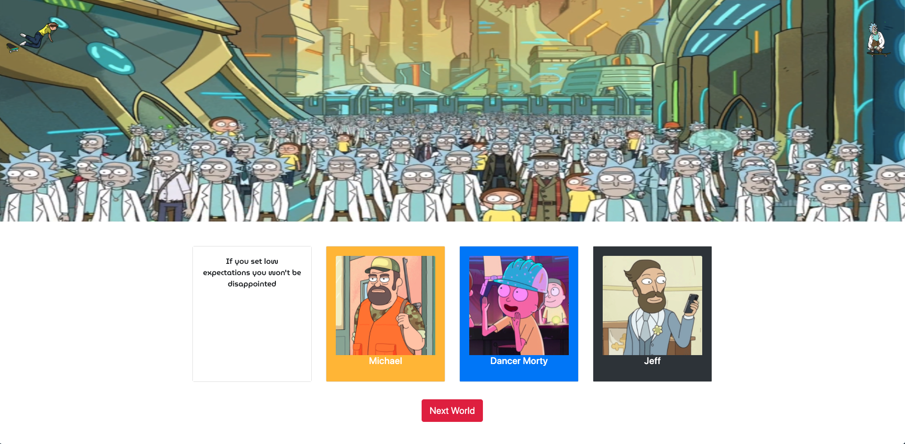
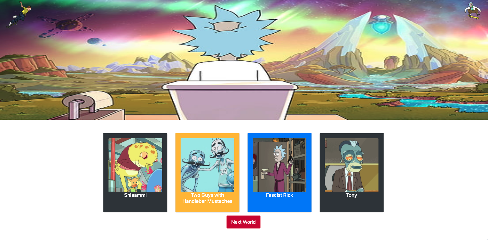
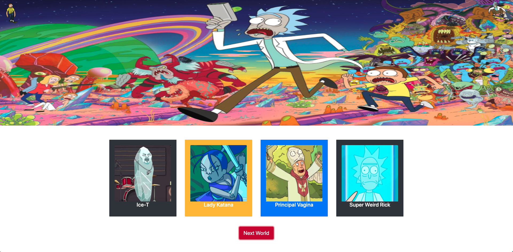
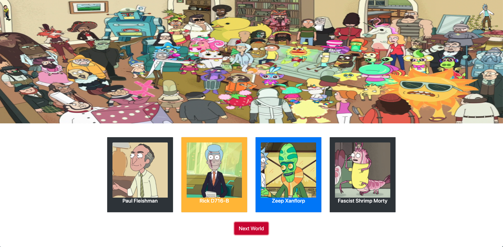
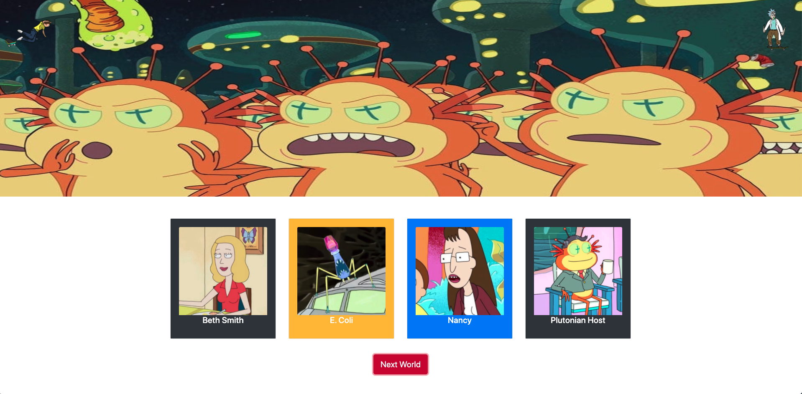
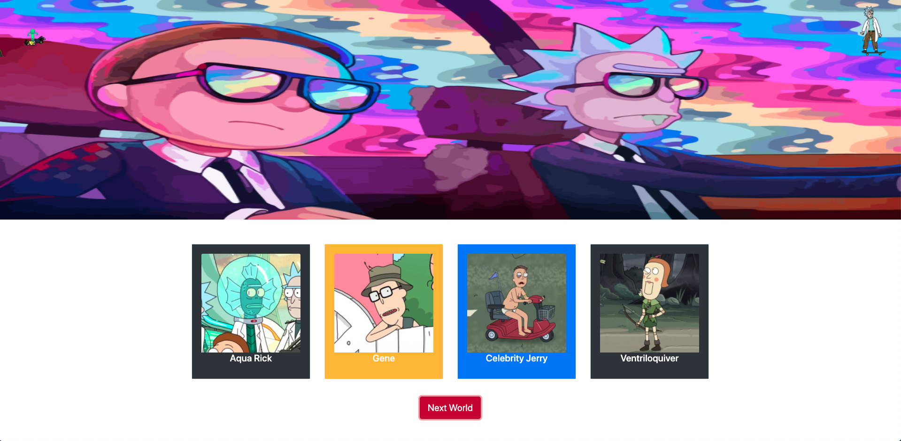
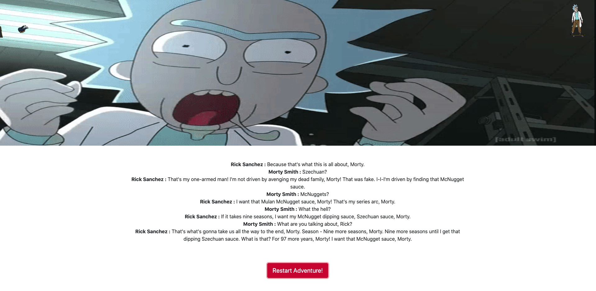

# Rick and Morty Adventure

## Description

We designed an application based on the Rick and Morty Television show. Once, the user clicks the start journey button on the website, the user is sent on journey to various worlds, where they are offered different life advice. In these different worlds there are various characters who have different advice on their cards. When the user flips the card, the advice from that character will be given to them. To pull the tip that will be displayed to the user, we used an API. The user is in for an adventure like no other!

## Table of Contents

- [Description](#description)
- [Acceptance_Criteria](#acceptance_criteria)
- [Installation](#installation)
- [Technologies](#technologies)
- [Contributors](#contributors)
- [Screenshot](#screenshot)
- [License](#license)

## Acceptance Criteria

```
* Use a CSS framework other than Bootstrap.

* Be deployed to GitHub Pages.

* Be interactive (i.e., accept and respond to user input).

* Use at least two server-side APIs.

* Does not use alerts, confirms, or prompts (use modals).

* Use client-side storage to store persistent data.

* Be responsive.

* Have a polished UI.

* Have a clean repository that meets quality coding standards (file structure, naming conventions, follows best practices for class/id naming conventions, indentation, quality comments, etc.).

* Have a quality README (with unique name, description, technologies used, screenshot, and link to deployed application).
```

## Installation

You can access the application by following this link: https://adellis95.github.io/Project-1/

Or go to my GitHub page and clone my Project-1 repository from here : https://github.com/Adellis95

Then you pull the cloned repository into your terminal/GitBash by using the "git pull (git@github.com:Adellis95/Project-1.git)

Afterwards, you change directories in your terminal until you are in the Project-1 repository and open the file in your code editor by typing "code ."

## Technologies

- JavaScript
- HTML
- CSS
- JQuery
- Rick and Morty API: https://rickandmortyapi.com/documentation
- Bad Advice Rest API: https://badadvice.rest/
- Rick and Morty Soundboard: https://www.101soundboards.com/boards/21656-rick-and-morty-soundboard

## Contributors

Front End - Tornubari Koboo and Austin Ellis

Back End - Claude and Dempsey

## Screenshot










## License

The MIT License

Copyright (c) 2020 Pod-11 GTPT-08-20

Permission is hereby granted, free of charge, to any person obtaining a copy
of this software and associated documentation files (the "Software"), to deal
in the Software without restriction, including without limitation the rights
to use, copy, modify, merge, publish, distribute, sublicense, and/or sell
copies of the Software, and to permit persons to whom the Software is
furnished to do so, subject to the following conditions:

The above copyright notice and this permission notice shall be included in
all copies or substantial portions of the Software.

THE SOFTWARE IS PROVIDED "AS IS", WITHOUT WARRANTY OF ANY KIND, EXPRESS OR
IMPLIED, INCLUDING BUT NOT LIMITED TO THE WARRANTIES OF MERCHANTABILITY,
FITNESS FOR A PARTICULAR PURPOSE AND NONINFRINGEMENT. IN NO EVENT SHALL THE
AUTHORS OR COPYRIGHT HOLDERS BE LIABLE FOR ANY CLAIM, DAMAGES OR OTHER
LIABILITY, WHETHER IN AN ACTION OF CONTRACT, TORT OR OTHERWISE, ARISING FROM,
OUT OF OR IN CONNECTION WITH THE SOFTWARE OR THE USE OR OTHER DEALINGS IN
THE SOFTWARE.
